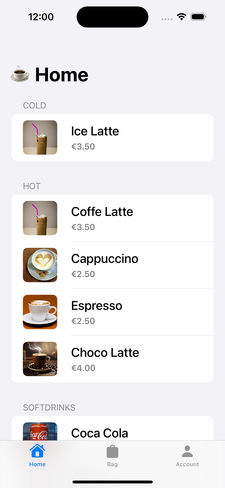
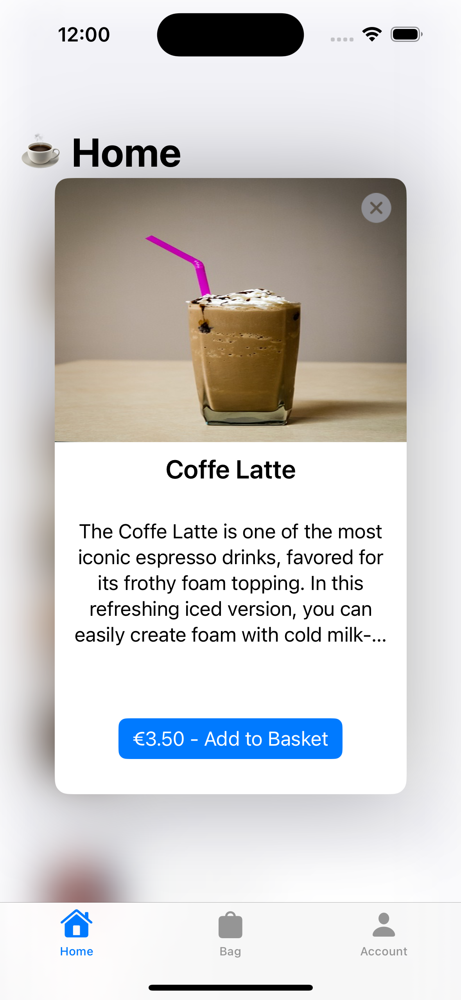
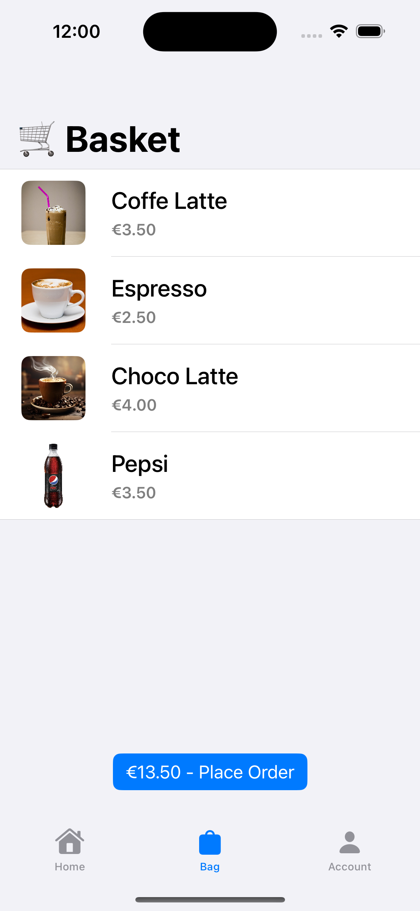
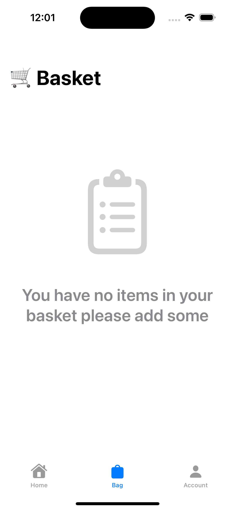
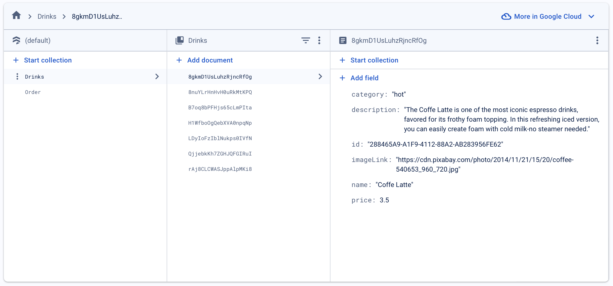

# CoffeeShop App

 CoffeeShop App implements a items list loaded from Firebase Cloud Storage where you can add each item to the basket to place an order for a user.

### Setup
This project was implemented using XCode 15.3 and iOS 17 deployment target.

## Summary

#### - ADVANCED APP DESIGN
The main goal to develop this simple app is demostrate the use of 
    - SwifUI
    - Firebase integration with Cloud Storege
    - Use @State, @Binding, @Published @StateObject, EnvironmentObjetc properties
    - Async and Await
    - Task{ } and .task{ } block to manage concurrency implementation
    - MVVM architecture to implement this solution.

#### - SWIFTUI USE
We will create a list of items with a "Add basket" button to add new ones and a detail view to show all items.

#### - Firebase
We save all items products in our Firebase Storage and fetch to load the view properly with all data showing the integration with this great tool.

# App screens

<table style="width:100%">
  <tr>
    <td></th>
    <td></th>
  </tr>
    <tr>
    <td></th>
    <td></th>
  </tr>
    <tr>
    <td></th>
  </tr>
</table>

### End

